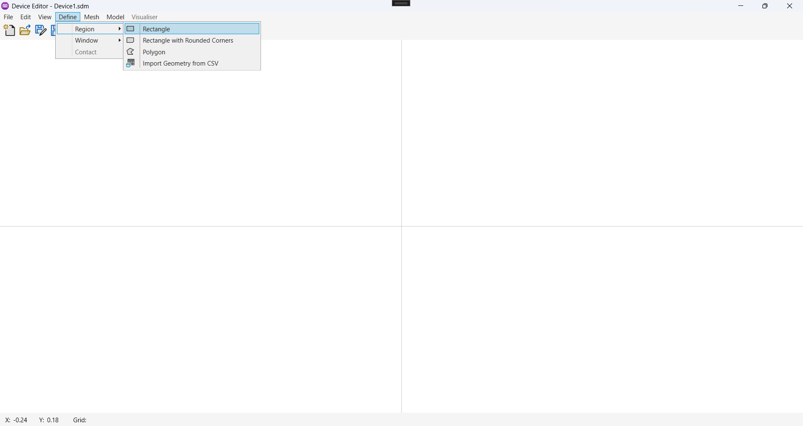

<p align="center">
  
  <h1 align="center">Aquarius TCAD Documentation</h1>
</p>

The repository holds the code and markdown source files for the Aquarius documentation website, which is accessible at [docs.kuasasemi.com](https://docs.kuasasemi.com)

## Index
- [Index](#index)
- [Documentation Issues](#documentation-issues)
- [Workflow](#workflow)
- [Conventions](#conventions)
- [Local setup](#local-setup)
  - [Requirements](#requirements)
  - [Setup](#setup)
  - [Installation](#installation)
  - [Running the Development Server](#running-the-development-server)
  - [Troubleshooting](#troubleshooting)

## Documentation Issues
If you come across any issues with the documentation or have a feature request related explicitly to it, create a new Jira Ticket and assign to the `Documentation` epic. Before creating a new ticket, check for existing issues to avoid duplication. 

## Workflow
The two suggested workflows are:

- For small changes, use the "Edit this page" button on each page to edit the Markdown file directly on GitHub.
- If you plan to make significant changes or preview the changes locally, clone the repo to your system to and follow the installation and local development steps in [Local setup](#local-setup).

## Conventions

- The front matter for every markdown file should include the `id` and a `title`. `id` will be used to reference the file in `sidebar.js` or `version-x.x.x-sidebars.json` for a specific version.
  ```yaml
  ---
  id: platform-support
  title: Supported Platforms
  ---
  ```

- Use `kebab-case` for file and folder names.
  For example:
  - `/docs/getting-started/ide-extensions.md`
  - `/docs/how-to/use-google-fonts.md`

- Images are important to bring the product to life and clarify the written content. For images you're adding to the repo, store them in the `img` subfolder inside `static` folder. For every topic there needs to be a folder inside `\static\img\` section, for example: `static\img\how-to\use-google-fonts\download-font.png`.
  
  When you link to an image, the path and filename are case-sensitive. The convention is `kebab-case`. `import` should be used to help detect broken images and placed near the top of the document for easier maintenance.

  > Example code for adding an image in markdown file:
  ```
  import ButtonGroup from '/img/button-group.png';
  
  ```
  
  Do not include quotes around the `src`'s attribute value.  

## Setup

### Requirements  

Ensure you have the following installed before proceeding:  

- **Node.js**: Version **18 or higher** 
  - If needed, download the latest version from [nodejs.org](https://nodejs.org/). 
  - Check your Node.js version:  
  ```sh
  node -v
  ```


- **npm**: Installed with Node.js  
  - Verify this with:  
  ```sh
  npm -v
  ```

### Installation  

After cloning the repository, navigate to the project folder and install dependencies:  

```sh
npm install
```

This will download and install all necessary packages required for running the Docusaurus project.

### Running the Development Server
To start the local development server, run:
```sh
npx docusaurus start
```

This will launch the documentation site at `http://localhost:3000/` by default. The site will automatically update as you make changes to the files.

### Troubleshooting
If you encounter issues, ensure all dependencies are installed correctly by running:
```sh
npm ci
```
- Check for any missing dependencies or errors in the terminal output.
- Restart the development server if changes are not reflecting.